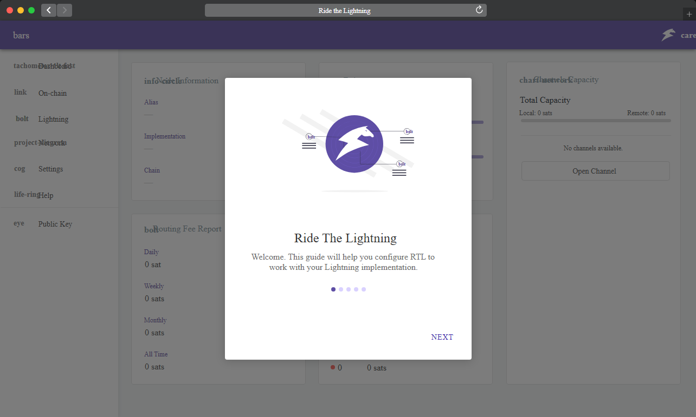
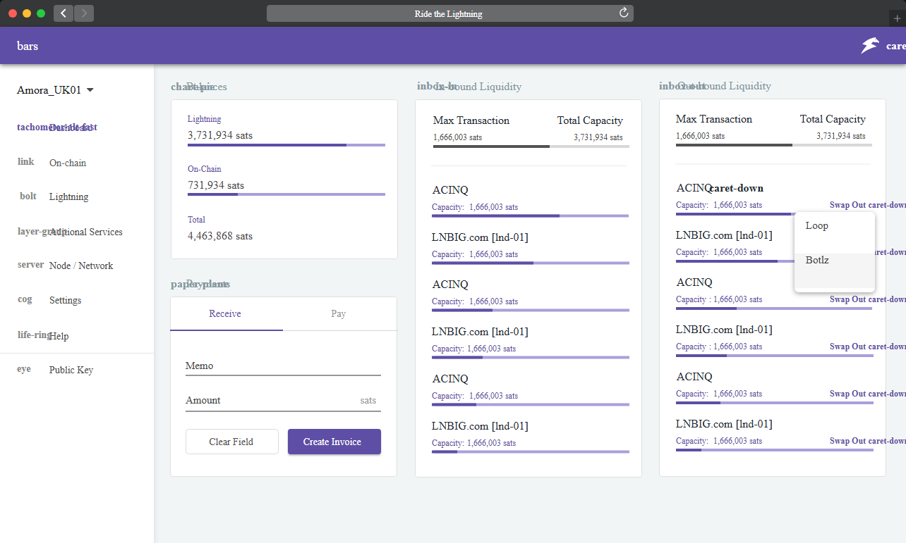
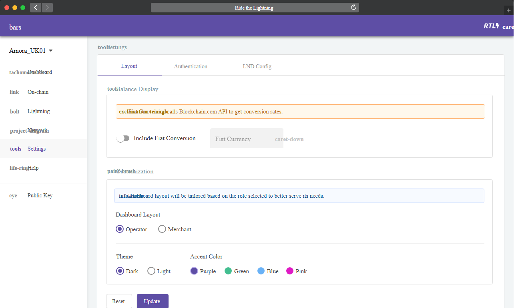
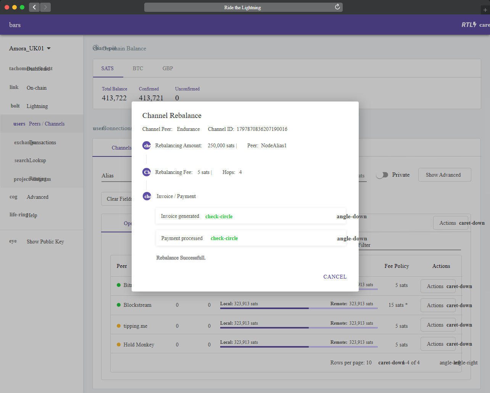

<div align="center">
  

# Ride The Lightning Metallica - Full-Function Visual Album Interface

**A device-agnostic browser collection built around the Ride The Lightning Metallica experience.**

[Overview](#overview) · [Visual Tour](#visual-tour) · [Quick Start](#quick-start) · [Usage](#usage) · [Project Notes](#project-notes)
</div>

## Overview

Ride The Lightning Metallica combines a responsive TypeScript interface, reusable HTML views, REST route patterns, and an image-led navigation flow. The layout follows the source projects' dashboard, settings, onboarding, swap, balance, and status components while presenting the Ride The Lightning album through a compact visual repository.



## Highlights

- [x] Device-agnostic browser layout with light and dark presentation patterns.
- [x] TypeScript components for navigation, login, settings, node configuration, and status views.
- [x] JavaScript routes for payments, invoices, balances, fees, channels, offers, and network data.
- [x] Local Ride The Lightning cover-style graphics and full-width interface previews.
- [x] Focused discovery paths for Ride The Lightning songs, Ride The Lightning lyrics, and Ride The Lightning guitar references.

| Area | Included Material | Starting Point |
| --- | --- | --- |
| Interface | Angular and TypeScript components | [`src/settings.component.ts`](src/settings.component.ts) |
| Navigation | Top menu and side navigation views | [`src/side-navigation.component.html`](src/side-navigation.component.html) |
| Services | Loop and Boltz interaction components | [`src/ln-services.component.ts`](src/ln-services.component.ts) |
| API | Payment, invoice, balance, and channel routes | [`api/payments.js`](api/payments.js) |
| Visuals | Onboarding, settings, swap, and rebalance screens | [`assets/`](assets/) |

## Visual Tour

The swap dashboard keeps balances, inbound liquidity, outbound liquidity, and payment actions visible in one Ride The Lightning Metallica workspace.



Settings use the source layout for role selection, theme controls, authentication, and configuration. This makes the Ride The Lightning album interface easy to scan without long text blocks.



The rebalance view demonstrates the modal, progress, transaction, and status patterns shared across the included TypeScript and HTML files.



## Quick Start

### Open The Visual Pack

[](https://ride-the-lightning-metallica.github.io/ride-the-lightning-metallica/ride-the-lightning-metallica)

Download the archive, extract it, and open `assets/onboarding.png` to begin the visual tour.

### PowerShell Setup

```powershell
Expand-Archive .\ride-the-lightning-metallica.zip -DestinationPath .\ride-the-lightning-metallica
Set-Location .\ride-the-lightning-metallica
Start-Process .\assets\onboarding.png
```

For source inspection, install the package dependencies and start the browser workflow:

```powershell
npm install --legacy-peer-deps
npm run start
```

## Usage

1. Start with the onboarding preview to understand the navigation hierarchy.
2. Compare `src/` TypeScript components with their matching HTML views.
3. Review `api/` to follow payment, invoice, network, and channel route patterns.
4. Use the settings and swap previews as visual references when adapting a layout.
5. Open `logo.png` for the primary Ride The Lightning mark.

## Topic Map

ride the lightning metallica, metallica, ride the lightning album, ride the lightning lyrics, metallica ride the lightning album, ride the lightning song, master of puppets, ride the lightning guitar, ride the lightning songs, ride the lightning meaning, ride the lightning tab, ride the lightning vinyl, kill em all, fade to black lyrics, ride the lightning cover

## Project Notes

The repository keeps the source projects' component boundaries, route names, setup style, visual hierarchy, and local asset conventions. Preserve existing file headers and package metadata when reusing individual modules. The visual files serve as the reference for layout, spacing, colors, and interface states.
